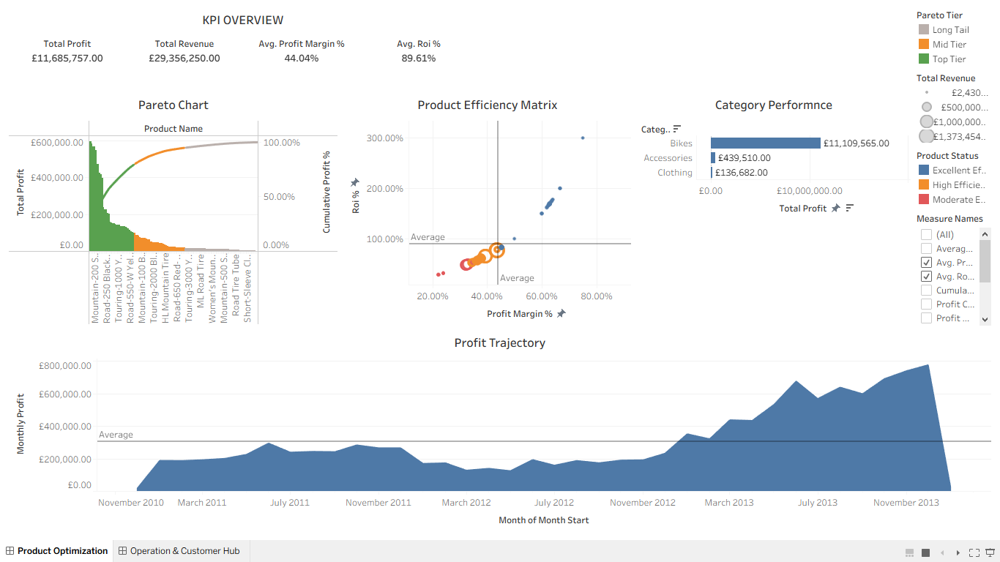
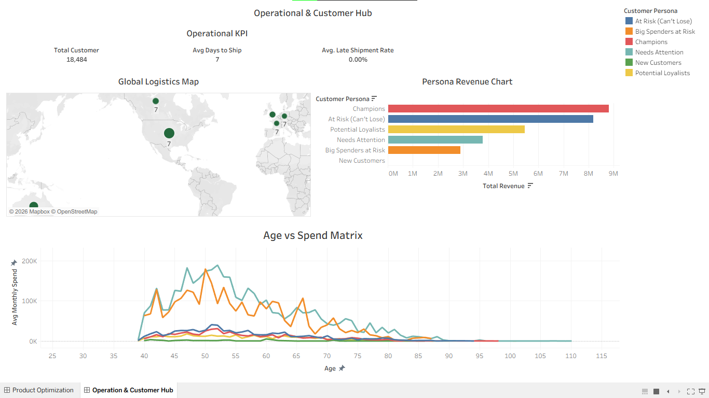

# End-to-End E-Commerce BI Pipeline: Data Engineering & Analytics Intelligence

## Project Overview
This repository contains a production-ready, end-to-end Business Intelligence pipeline that transforms raw relational e-commerce transaction data into clean, performance-optimized analytical views. By shifting heavy calculations upstream into **T-SQL** and virtualizing the business logic into 4 custom "Wide Tables", the pipeline minimizes data-processing latency and delivers seamless, sub-second interactive analysis inside Tableau Desktop.

The system is split into two specialized strategic hubs:
1. **The Product Intelligence Hub:** Focused on product performance, unit economics, ROI, and Pareto margin optimization.
2. **The Operations & Logistics Hub:** Focused on customer value tracking (RFM), global distribution, and supply chain supply bottlenecks.

---

## Tech Stack & Architecture
* **Database Engine:** T-SQL / Microsoft SQL Server
* **Business Intelligence:** Tableau Desktop
* **Design Pattern:** Computed-View Layer Strategy using Star Schema dimensions

---

## The ETL Pipeline & SQL Architecture

The data pipeline extracts records from primary transactional tables (`fact_sales`, `dim_products`, `dim_customers`), processes the data through recursive Common Table Expressions (CTEs), and materializes the output via virtual views.

### Pillar 1: Customer Intelligence (`vw_customer_360`)
* **Process:** Calculates discrete customer milestones (Lifespan, Recency, Frequency) while resolving leap-year precise age calculations. 
* **Advanced Logic:** Uses `NTILE(5)` window distributions across Recency, Frequency, and Monetary values to dynamically build an automated **RFM Segmentation Engine** that labels customers into actionable marketing tiers (e.g., *Champions*, *Big Spenders at Risk*).

### Pillar 2: Product Optimization (`vw_product_360`)
* **Process:** Consolidates product transaction counts, unit sales, gross revenue, and cost of goods sold (COGS). It computes weighted unit economics via `NULLIF` to guard against mathematical division-by-zero errors.
* **Advanced Logic:** Deploys a deterministic window function (`SUM() OVER (ORDER BY... ROWS UNBOUNDED PRECEDING)`) to establish a running profit total. This forms the exact boundary lines for an automated **80/20 Pareto Curve Analysis**.

### Pillar 3: Macro Time Trends (`vw_time_machine_trends`)
* **Process:** Constructs a continuous monthly date dimension from transactional timestamps to prevent time-series gaps.
* **Advanced Logic:** Employs analytical lead/lag structures (`LAG(..., 1)` and `LAG(..., 12)`) to cache historical values in memory. This facilitates clean, resource-light calculations of Month-over-Month (MoM) and Year-over-Year (YoY) net growth metrics.

### Pillar 4: Supply Chain Logistics (`vw_logistics_bottleneck`)
* **Process:** Implements a two-step grain consolidation pattern. Step one aggregates line-item transactions to a strict Order Grain to prevent shipment day skewing. Step two rolls up data to the Country Grain.
* **Advanced Logic:** Evaluates fulfillment intervals against a defined 7-day operational SLA to generate a precise, un-skewed `Late Shipment Rate` per global region.

---

## Key Analytical Findings

| Core Metric Pillar | Key Finding Detected | Technical/Operational Root Cause |
| :--- | :--- | :--- |
| **Pareto Concentration** | Top-Tier items generate **79.41%** of total profit. | A concentrated group of high-margin items carries the business. The remaining Mid Tier and Long Tail items introduce operational complexity with low financial yield. |
| **Category Performance** | **Bikes** dominate the business with **£11.1M** in net profit. | While Accessories lead the absolute unit volume (>30k units), Bikes operate on superior, high-efficiency margin structures that drive the company's true wealth. |
| **Efficiency Matrix** | Strict linear correlation between **Profit Margin %** and **ROI %**. | Highly efficient blue-chip products cluster cleanly in the top right quadrant (High Margin / High ROI), proving the model relies on premium price positioning rather than high-volume discount clearing. |
| **Fulfillment Bottlenecks** | Identifying latency anomalies in specific regions hubs. | The logistics view isolated regions exceeding the 7-day delivery SLA, pinpointing exactly where late shipment rates damage local customer health. |

---

## Strategic Business Insights & Verdicts

### 1. Working Capital Optimization via SKU Rationalization
The **Long Tail** product segment contributes less than 5% of cumulative profit but accounts for a massive footprint in terms of unique item counts. 
* **Verdict:** Management should initiate a SKU rationalization program to clear out the bottom-performing 5% of inventory. This will free up significant warehouse capacity and reduce administrative overhead without impacting top-line profitability.

### 2. Supply Chain Risk Mitigation for Top-Tier Assets
Because 80% of net company wealth relies heavily on a narrow group of "Top Tier" products, a supply chain breakdown or stock-out on any of these items represents an immediate, severe revenue threat.
* **Verdict:** Implement an automated "Safety Stock Buffer" protocol and prioritize logistics clearance specifically for Top-Tier items to ensure 100% inventory availability.

### 3. Deceptive Sales Volume Re-Alignment
The Accessories segment moves high unit volumes, creating an "illusion of performance." However, the data reveals that the organization is exerting high operational effort for low relative margin returns.
* **Verdict:** Shift a portion of acquisition marketing capital away from cheap accessories and reallocate it toward high-efficiency "Rising Stars" identified in the **Mid Tier** product matrix to scale net cash returns.

---

## Live Interactive Dashboards

Click on either dashboard image below to open the live, fully interactive version on Tableau Public.

### 1. Product Intelligence & ROI Optimization Hub

---

### 2. Operations & Customer Hub

